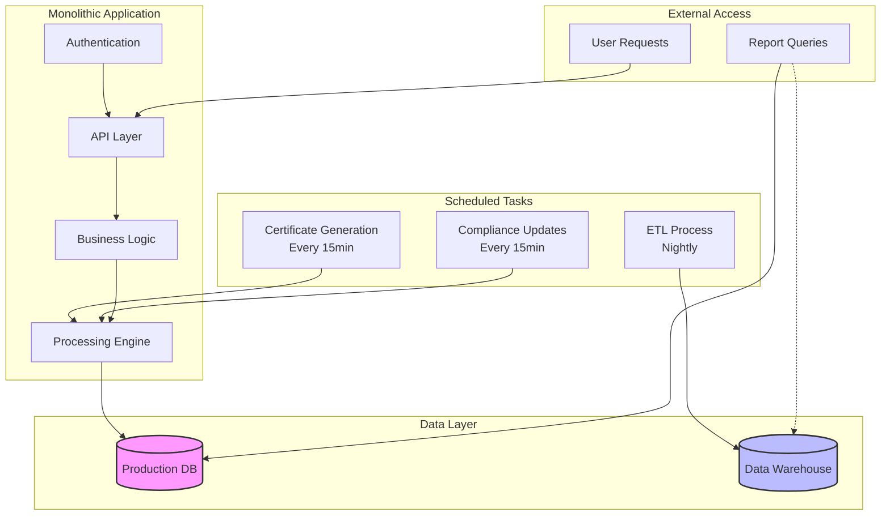

Have you ever stared at a system where "real-time" means "check back in 15 minutes"? That was exactly where we found ourselves at NBI, managing our complex web of systems that supported the business of providing continuing education for the legal community. Every quarter hour, "TaskEngine" would spring to life, processing attorney tracking records and generating completion certificates. Meanwhile, our analytics team was running complex reports directly against production databases because yesterday's data in the warehouse data might as well have been from last month.

Picture this: An attorney completes their required ethics course at 13:42. They need their certificate immediately for a compliance deadline, but our system won't generate it until 13:50. They call customer support at 13:47, who messages the accredidation team asking what the customer did wrong, who messages the development team explaining that everything looks accurate. By the time our team explains the delay (again), the certificate is already generated anyway. Multiply this by thousands of attorneys during the peak end-of-year reporting deadline period, add in department heads running resource-intensive reports against production databases for time-sensitive compliance data, and you have a recipe for both customer frustration and system strain.

In this post, I'll walk through how we are transforming our monolithic, schedule-based architecture into a modern, event-driven system that handles our CLE processing with the grace of a well-briefed legal argument. You'll learn:

- Why scheduled batch processing can create unnecessary friction in customer experience
- How event-driven architecture can deliver near-real-time data processing and reporting
- The step-by-step process we are using to migrate without disrupting our core business operations
- Real lessons learned from managing this transformation

Whether you're running a legal tech platform or any system where "near real-time" used to mean "tomorrow" but now needs to mean "before the customer hits F5 again", this architectural journey will show you how we are breaking free from the chains of batch processing and embrace a more responsive, scalable future.

## The Starting Point: Anatomy of a Monolithic Cron Architecture

Our previous architecture represented a common pattern in enterprise software: a monolithic application driven by scheduled tasks. At its core, our system handled three primary types of data processing: certificate generation, compliance status updates, and analytics reporting.

The monolithic application contained all business logic for our CLE platform, from user authentication to course completion tracking. Every fifteen minutes, a scheduled task would query the database for newly completed courses and generate certificates. This process, while straightforward, introduced artificial delays in our service delivery. An attorney completing a course would need to wait up to fifteen minutes to receive their completion certificate, regardless of system load or processing requirements.

Our reporting infrastructure followed a similar pattern. Each night, an ETL process would copy data from our production database to a data warehouse. This approach created a significant lag in data availability, forcing many departments to run their queries directly against production databases to access current information. The impact was twofold: reporting queries strained our production system, while the data warehouse became increasingly underutilized due to its staleness.

The architecture's limitations became increasingly apparent as our platform grew. The scheduled tasks created artificial bottlenecks, processing records in batches regardless of system capacity or demand. During peak periods, such as end-of-compliance-period rushes, the fifteen-minute delay in certificate generation led to increased support calls and customer frustration. Conversely, during quiet periods, the system would still wake up every fifteen minutes to check for new completions, consuming resources unnecessarily.

The reporting infrastructure posed even greater challenges. The nightly ETL process meant that our data warehouse was perpetually out of date. Department heads needing current compliance statistics, finance requiring up-to-date revenue figures, and operations teams monitoring course completion rates all bypassed the data warehouse. Instead, they ran their queries directly against our production database, creating unpredictable load patterns and potentially impacting platform performance.

Error handling in this architecture was particularly problematic. If the certificate generation process encountered an error, it would need to wait for the next fifteen-minute cycle to retry. Similarly, if the nightly ETL process failed, we would face a full day's delay in updating our reporting data. These rigid schedules made our system brittle and inflexible, unable to adapt to real-world demands and failure scenarios.
