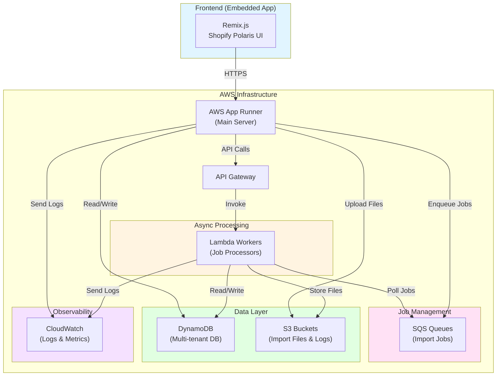

Product catalog imports into Shopify are one of those problems that seems simple until you actually try to solve it. The Shopify App Store has plenty of import tools, but they all make the same trade-offs: either they're feature-limited free apps that work for basic catalogs, or they're enterprise solutions with pricing that assumes you're managing thousands of SKUs. What if you need advanced features like metafield management and metaobject support, but you're not running a Fortune 500 operation?

I'm building **Inavor Shuttle** to solve this problem while learning AWS inside and out. This isn't just another side project that dies after the MVP—I'm architecting this as a production-ready Shopify app that could actually ship to the App Store.

> A post in the [Inavor Shuttle](/series/inavor-shuttle) series, documenting the journey of building a production-ready Shopify app while mastering AWS infrastructure.

## 😱The Problem Worth Solving

Shopify's native import tools handle basic product data, but modern storefronts rely heavily on metafields and metaobjects for everything from size charts to custom product attributes. Merchants face several pain points:

- **No dry-run capabilities** mean testing imports on live data (terrifying)
- **Limited import modes** force all-or-nothing approaches instead of selective updates
- **Metafield management** requires manual GraphQL calls or expensive apps
- **No progress tracking** leaves merchants wondering if their 10,000-product import is working
- **Zero visibility** into what failed and why when imports go wrong

Existing apps partially address these issues, but I want full control over the entire process. When a merchant needs a specific import workflow or custom metafield handling, I can build it. When Shopify updates their API, I can adapt immediately instead of waiting for a vendor to update their SaaS platform.

## 🧰The Technical Stack

This project is deliberately overengineered for a learning project, but appropriately engineered for a production app. Shopify owns Remix, making it the natural choice for embedded apps. AWS provides the serverless, production-grade infrastructure patterns I want to master. TypeScript throughout ensures type safety across the entire codebase—from frontend components to Lambda functions to infrastructure definitions.

**Frontend**: Remix.js with Shopify Polaris for the embedded app experience, plus Tailwind CSS and shadcn/ui for supplemental styling.

**Backend**: Node.js 20.x with TypeScript in strict mode, running on AWS App Runner for the main application server.

**AWS Infrastructure**: The real focus of this project. I'm using DynamoDB for multi-tenant data storage, Lambda for async job processing, S3 for file management, SQS for job queuing, EventBridge for orchestration, and CloudWatch for monitoring. All infrastructure deployed via AWS CDK (TypeScript).

## ✨The Idealized Solution

The perfect import tool wouldn't force merchants to choose between safety and capability. It would let them test changes without risking their live catalog, see exactly what's happening during long-running imports, and understand precisely what failed when something goes wrong.

Most import apps treat metafields as an afterthought—if they support them at all. Inavor Shuttle treats them as first-class features because that's how modern Shopify stores actually work. The "shopify" namespace for metafields is notoriously tricky to work with, so most tools skip it entirely. But merchants need it for things like size charts and product specifications that Shopify's themes rely on.

Import modes matter too. Sometimes merchants want to replace their entire catalog. Sometimes they only want to add new products without touching existing ones. Sometimes they need to update drafts while leaving published products alone. A merchant-first tool offers all of these workflows instead of forcing everyone through the same process.

The architecture enables this flexibility. Async job processing with real-time progress tracking means merchants aren't left wondering if their 10,000-product import is working. Detailed error reporting with S3-backed logs means debugging failed imports doesn't require guesswork. Multi-tenant design from day one means adding new storefronts doesn't require architectural rewrites.

This is what full control looks like: building exactly what merchants need, not what a SaaS platform's roadmap allows.

## 🏗️The Implementation Plan

Phase 1 establishes the foundation that everything else builds on. Shopify OAuth and multi-tenant architecture come first—getting authentication right matters more than any feature that follows. Once merchants can connect their stores securely, the core import functionality follows: JSON-based templates with schema validation, async job processing with real-time progress tracking, and all four import modes with dry-run support. Comprehensive testing and documentation throughout ensures the foundation is solid before building on it.

Future phases depend on whether Phase 1 proves valuable. Advanced metafield introspection could help merchants understand their store's schema better. Catalog export gives them a baseline for building import templates. Scheduled imports and webhook-triggered imports transform the tool from manual batch processor to automated workflow engine. Enhanced error recovery with automatic retries makes the system more resilient. But all of that waits until merchants actually want what Phase 1 delivers.

## ⭐Following Along

The complete codebase lives at [github.com/rovani-projects/inavor-shuttle](https://github.com/rovani-projects/inavor-shuttle). Each major feature gets its own blog post—expect focused explanations of what I built, why I built it that way, and what I learned when things didn't work as expected.

**Want to follow along?** Star the repo, watch for updates, or open issues with questions and feedback. I'm particularly interested in hearing from Shopify merchants about import workflows that current tools don't handle well.

## 🚀What's Next

The foundational work is already underway—authentication, database schema design, and AWS infrastructure setup. The next post will dive into the first substantial feature implementation, covering both the product development decisions and the technical implementation details.

This isn't going to be a dissertation on every decision point or a tutorial series on learning AWS. Instead, expect focused posts that explain what I built, why I built it that way, and what I learned when things didn't work as expected. Particularly when dealing with poorly documented features or undocumented edge cases in the Shopify Admin API.

Building production software means making trade-offs. I'll document mine so you can learn from them—whether you're building Shopify apps, learning AWS, or just curious how to architect a real system instead of following tutorials.

_Questions about the project? Interested in a particular feature? Drop a comment below or open an issue on the GitHub repo._
